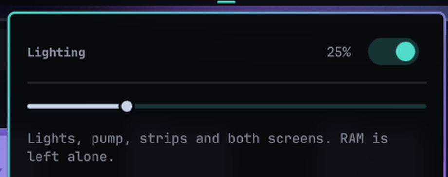

# RGB Control for the Omarchy bar

One slider for the brightness of every light on the machine, and one switch that
turns all of them off. The bar shows a small ring whose filled centre grows with
the level; when everything is dark, the ring is left hollow.



## What it touches

| Target | How |
|---|---|
| Motherboard ARGB headers, graphics card | `openrgb` — mode, accent colour and `-b` percentage |
| AIO pump and fans, wireless strips and fans | the Lian Li daemon's Unix socket: one `SetRgbConfig` per change |
| Cooler screen backlight | the same socket, `SetLcdBrightness` |
| 8.8" case panel | `bezel brightness` |

Brightness on Lian Li hardware has five firmware levels, so the slider quantises
there (0, 25, 50, 75, 100) while OpenRGB and the screens take the exact value.

Deliberately out of scope: **RAM modules**. Their RGB sits behind the ENE SMBus
controller, and writing to it has a history of damaging DDR5 modules. The widget
never sends anything to them.

## Actions

| Input | Result |
|---|---|
| Left click on the bar glyph | open the popup |
| Middle click | switch every light off, or back to the last level |
| Drag the slider | the level applies on release, one command per drag |
| Right click the slider | toggle all lights |
| Arrow keys, Escape | nudge by 5, close |

## Requirements

Everything is optional — a missing tool is skipped, not fatal:

- `openrgb` for the motherboard and the graphics card;
- [lian-li-linux](https://github.com/sgtaziz/lian-li-linux) running as the user
  daemon, for the AIO, its fans and the wireless strips;
- [bezel](https://github.com/slipalison/bezel) for the 8.8" case panel;
- `omarchy-theme-color` (part of Omarchy) to read the current theme accent.

## Install

```bash
omarchy plugin install https://github.com/vyorkin/omarchy-rgb
```

Or by hand:

```bash
git clone https://github.com/vyorkin/omarchy-rgb ~/.config/omarchy/plugins/io.github.vyorkin.omarchy-rgb
omarchy restart shell
```

Then add it to the bar if the shell does not offer to:

```bash
omarchy bar move io.github.vyorkin.omarchy-rgb --section right
```

## Command line

The widget is a thin QML front end for `bin/omarchy-rgb`, which is usable on its
own:

```bash
bin/omarchy-rgb status          # lights on, 60%, accent #50dcc8
bin/omarchy-rgb status --json   # {"on":true,"brightness":60,"accent":"#50dcc8"}
bin/omarchy-rgb set 60
bin/omarchy-rgb on
bin/omarchy-rgb off
bin/omarchy-rgb toggle
bin/omarchy-rgb accent          # the accent colour of the current Omarchy theme
```

State lives in `${XDG_STATE_HOME:-~/.local/state}/omarchy-rgb/state.json`, so
`on` can restore the level you were at before switching everything off.

## Latency

`openrgb` re-detects the whole machine on every run — about three seconds per
device — which is far too slow to sit behind a slider. Two paths fix that:

- **The board.** The helper sends the same two packets as the command line -
  `UPDATEMODE` with `color_mode = 0` and one black colour, then `UPDATELEDS` with
  the real one - straight to a background `openrgb --server`. That order and that
  `color_mode` are what make the driver take its colour from the LED array; a
  reversed order or the `color_mode` from the device description paints the old
  colour. The run was checked packet by packet against `openrgb` through a
  logging proxy, so the two are byte-for-byte equal, and the helper is ~60 times
  faster because it does not re-detect the machine. The command line remains the
  fallback.

Deprecated note: the board.
  to a background `openrgb --server`: the colour goes into the LED array and the
  mode is re-applied, which is the same thing `openrgb -m Static -c ...` does,
  in about 17 ms instead of a second of re-detecting the machine. The command
  line stays as the fallback, and the graphics card is only ever written that
  way because it has no LEDs for an array. The server is started on demand — the first
  change after a boot falls back to the slow path in the background and warms the
  server up, so everything after it is immediate.
- **Lian Li.** Brightness goes over the daemon's socket. The guard that a write
  needs is cached on disk, the cooler screen's backlight rides in the same
  process, and the command stops waiting after 150 ms: the daemon sometimes holds
  a queue while it uploads frames to the wireless strips, and the interface must
  not wait for that.

| Target | Time to apply |
|---|---|
| Lian Li devices (socket) | ~60 ms |
| Motherboard and graphics card (SDK) | ~15 ms |
| Cooler screen backlight | ~60 ms |
| 8.8" panel (`bezel`) | ~15 ms |
| Whole `set` command | 70–190 ms |

Measured end to end: `omarchy-rgb set N` went from 6.3 s to 70–190 ms, an
unchanged value costs 4 ms and touches nothing, and six rapid changes collapse
into one write instead of six.

## Brightness through colour

Lian Li's firmware has five brightness levels, and the plain brightness field of
an ASRock mode is not even acknowledged by the driver (`MODE_FLAG_HAS_PER_LED_COLOR`
without the brightness flag). Both therefore dim by scaling the **colour**: the
theme accent is multiplied by the level, so 3% is really `#020706` and not "the
dimmest of five steps". Switching off sends black rather than a mode change, which
is why it is instant as well.

The accent of the current Omarchy theme is the single source of that colour, the
same one the theme hook writes. Per-zone colours set by hand in the Lian Li GUI
are replaced by it whenever the slider moves.

### Surviving a theme switch

The theme hook restarts the Lian Li daemon, which then spends up to fifteen
seconds bringing its RGB controller up. Two things followed from that, and both
are fixed:

- the widget writes through a cached `WriteGuard` and a long-lived socket; after
  a restart both are stale, so a failed write now reconnects, refreshes the guard
  and retries once, and a write that still fails is retried in the background
  until the daemon answers — but only while the value is still the current one, so
  a stale retry can never overwrite a newer level;
- the theme hook does not race the daemon at all any more, and it does not
  restart it either. The colours and the screen template go over the daemon's
  socket, so the pump and its fans change in about two seconds instead of waiting
  for a restart and the fifteen seconds the cooler then needs to come up. The
  configuration file is still written, for the case where the daemon is not
  running;
- the motherboard's mode is set once per boot rather than on every theme change.
  Each mode write is visible as a flicker of the strip, and the mode itself -
  Static - does not depend on the theme, so only the colour is written afterwards;
- the level itself lives in `state.json`, which the hook reads before it touches
  anything, so the new theme's colours arrive at the brightness you chose - and a
  light you switched off stays off through a theme switch;
- the motherboard and the graphics card are painted by the same code path as the
  slider, not only by the `openrgb` command line. The ASRock driver stores a
  per-LED colour with its red and blue channels swapped for Static mode, so a
  colour written by the two paths differently shows up as a different hue; going
  through the SDK keeps the theme hook and the slider in agreement.
- the live level is written to the configuration file as well as to the device.
  The cooler screen's brightness goes over IPC, which never reaches the file, and
  the file is what the daemon applies when the hook restarts it.

### The board is verified, not assumed

`openrgb` exits 0 whether or not a colour reached anything, and a colour written
through the SDK has to be confirmed against the device rather than the log. The
helper can now read a device's own report back and count how many of its LEDs
carry the colour we asked for (`bin/openrgb-fast.py verify <percent> <accent>
<device>`), and the theme hook records the verdict. One subtlety this caught: the
server's device indices are not stable — the board moved from index 4 to 3 when
the server was restarted — so an index is now confirmed against the device's name
before anything is written, and the cache is rebuilt when they disagree. Writing
by a stale index paints the wrong device and leaves the right one untouched.

## The theme hook

`bin/omarchy-rgb-sync` makes the lights and both screens follow the Omarchy theme.
It reads the staged palette, applies the colours to the Lian Li daemon over its
socket (no restart: the daemon would otherwise spend fifteen seconds bringing its
RGB controller up), writes the motherboard's colour as its *mode* colour - one
writer only, because the hardware keeps the mode colour and the per-LED array
apart and shows whichever was written last - and regenerates the 8.8" panel theme.

Install it as a hook, once, with a wrapper so the real script stays in one place:

```sh
printf '#!/usr/bin/env bash
exec "$HOME/.local/bin/omarchy-rgb-sync" "${1:-}"
' \
  > ~/.config/omarchy/hooks/theme-set.d/00-omarchy-rgb-sync
cp ~/.config/omarchy/hooks/theme-set.d/00-omarchy-rgb-sync \
   ~/.config/omarchy/hooks/post-boot.d/00-omarchy-rgb-sync
chmod +x ~/.config/omarchy/hooks/theme-set.d/00-omarchy-rgb-sync \
         ~/.config/omarchy/hooks/post-boot.d/00-omarchy-rgb-sync
```

The name starts with `00-` on purpose: the theme engine runs the hooks in name
order, and the lighting is the part you notice first. It keeps its own log in
`~/.local/state/omarchy-rgb/sync.log`, which is what to read when a colour did not
arrive.

### When the two chains disagree

If the lights on the board's ARGB headers and the Lian Li ones stop matching, find
out what they were *told* before touching any script. Both chains should hold the
same colour - the theme accent times the slider level:

```sh
python3 -c 'import json,os; c=json.load(open(os.path.expanduser("~/.config/lianli/config.json"))); print([z["effect"]["colors"][0] for d in c["rgb"]["devices"] for z in d.get("zones") or []])'
```

If the two are equal, the scripts are not at fault: the disagreement is either
inside the LED controller or in the driver's own per-zone settings, and neither of
those is a file this project owns. Restart the OpenRGB server and let the hook paint
again:

```sh
for pid in $(pgrep -f "openrgb --serve[r]"); do kill "$pid"; done
~/.local/bin/omarchy-rgb-sync
```

The driver re-applies its `RGSwap` settings for every header when it initialises,
which is exactly what a stale controller state needs. That fixed a real divergence
here, with no reboot involved. Check this before rewriting anything in the write
path - doing it the other way round cost this project several hours.

### Two sliders

The popup has one slider for the lighting and one for the cooler's 480x480 screen,
because they are different devices and dimming the strips should not dim the screen.
The screen's value lives in `lcd_brightness` beside the level, and the theme hook
reads it, so a theme switch no longer resets it.

The screen's brightness needs **both** calls, and that is not belt and braces:
`SetLcdBrightness` changes the screen (the daemon answers `applied: true`) but leaves
its own copy of the LCD settings alone, so the daemon writes the stale value back at
its next save; `SetConfig` updates that copy but does not touch the screen, so on its
own it changes nothing you can see. Sending the pair is what makes the slider both
visible and permanent. The 8.8" case panel still follows the lighting slider.

### Screen themes

The cooler's 480x480 screen has four layouts, built by `bin/lcd_themes.py` from the
palette of the active theme:

| id | what it is |
|---|---|
| `grid` | four values in a 2x2 grid with labels above |
| `large` | two temperatures very large, the two loads below |
| `bars` | four rows, each with a label, a value and a bar |
| `gauges` | two round gauges for the temperatures, the loads underneath |

Pick one with `omarchy-rgb lcdtheme <id>` or from the buttons in the popup; the
choice is kept in the plugin's state, and the theme hook rebuilds the colours from
the new palette while leaving your layout alone.

Every layout is checked before it goes to the screen: `bin/lcd_themes.py --check`
reports text that does not fit its box, boxes that leave the panel and boxes that
overlap, and `lcdtheme` refuses to install a layout that fails. That matters because
a widget's box is also the area the display clears before drawing: with a box smaller
than the text, the previous digits stay on screen and the numbers appear to pile up on
each other. Sizes are computed from the font rather than guessed, values show no unit
(the label carries it, so three digits always fit) and the font is dropped to 92 px in
the grid instead of 104 so that four cells do not touch.

Every text colour is checked against the background and lightened until it clears a
contrast of 7:1 for values and 5:1 for labels (WCAG, the same measure browsers use).
That check exists because it caught a real case: a palette painted all four values
the same colour, one of them dark red on near-black at a contrast of 1.7 - the
numbers were effectively invisible. Values are also pushed apart from each other if
the palette collapses them into one colour.

## Configure

Device names for OpenRGB and the AIO's device ID are listed at the top of
`bin/omarchy-rgb`:

```bash
OPENRGB_DEVICES=(
    "ASRock X870 Pro RS WiFi"
    "MSI GeForce RTX 5080 Gaming Trio OC"
)
AIO_LCD_DEVICE="hid:0416:7395:8-12"
```

Run `openrgb --list-devices` to see the names OpenRGB uses on your machine. Lian
Li devices are not listed by hand: they come from the daemon's own configuration,
so strips and fans that appear later are picked up on their own.

## Notes

- Lian Li writes need a `WriteGuard`, which pins the daemon version and instance
  id. The script asks for `GetDaemonInfo` first and wraps every write, exactly as
  the Lian Li GUI does. A daemon that is older or newer than the script reports
  `Changes require a compatible client` instead of applying the level.
- The script never restarts the Lian Li daemon: brightness goes through IPC, so
  the AIO screen does not re-initialise on every slider move.
- If the Lian Li daemon is not running, only OpenRGB and the panel are touched.

## Licence

MIT.
